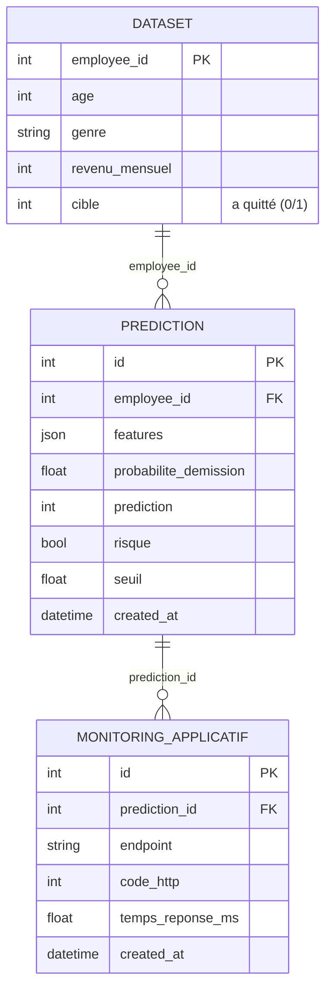

## 🗄️ Base de données

L'API stocke chaque prédiction et surveille son propre fonctionnement dans une
base **PostgreSQL** (hébergée sur **Neon**, un service managé dans le cloud).
La connexion est fournie via la variable d'environnement `DATABASE_URL`
(stockée en secret, jamais dans le code). En local et en intégration continue,
l'application bascule automatiquement sur une base **SQLite** de test.

### Schéma relationnel

> Le schéma est aussi disponible en image : [`docs/schema_bdd.png`](docs/schema_bdd.png).

### Les trois tables

| Table | Rôle | Clé primaire | Clé étrangère |
|-------|------|--------------|----------------|
| **`dataset`** | Données de référence du Projet 4 (les 3 fichiers RH joints), utilisées comme historique | `employee_id` | — |
| **`prediction`** | Une ligne par appel à `/predict` : les données d'entrée (`features`) et le résultat du modèle | `id` | `employee_id` → `dataset` |
| **`monitoring_applicatif`** | Métriques techniques de chaque appel : temps de réponse et code HTTP | `id` | `prediction_id` → `prediction` |

Les tables ne sont pas isolées : elles forment un **modèle relationnel**. Une
prédiction peut être rattachée à un employé connu du `dataset`
(`prediction.employee_id`), et chaque mesure de monitoring est rattachée à sa
prédiction (`monitoring_applicatif.prediction_id`). On peut donc, pour n'importe
quelle prédiction, retrouver l'employé concerné **et** les métriques de l'appel.

### Parcours d'une requête : input → prédiction → monitoring

1. **Input** — le client envoie les données d'un employé à `POST /predict`
   (après authentification). Les entrées sont validées par Pydantic.
2. **Prédiction** — le modèle calcule la probabilité de démission ; une ligne
   est écrite dans **`prediction`** (les `features` reçues + le résultat).
3. **Monitoring** — le temps de traitement et le code HTTP sont enregistrés dans
   **`monitoring_applicatif`**, relié à la prédiction par `prediction_id`.

L'écriture en base est protégée : si la base est momentanément indisponible, la
prédiction est tout de même renvoyée au client (la journalisation n'interrompt
jamais le service).

Les tables sont **créées automatiquement au démarrage** de l'application, et le
`dataset` de référence est **ingéré** au premier lancement s'il est vide
(voir `db/init_db.py`). Un script autonome `db/ingest.py` permet aussi de le
faire manuellement.

### À quoi servent les données enregistrées (usage analytique)

Journaliser les prédictions et les métriques n'est pas qu'une trace : c'est la
base d'un **suivi en production** du modèle et de l'API.

À partir de la table **`prediction`**, on peut :
- suivre la **proportion d'employés jugés à risque** dans le temps, et la comparer
  au taux réel observé dans le `dataset` (`cible`) pour estimer la pertinence ;
- détecter une **dérive des données** (*data drift*) : si la distribution des
  `features` reçues s'éloigne de celle des données d'entraînement, c'est un signal
  qu'il faudra ré-entraîner le modèle ;
- analyser **quels profils** sont le plus souvent classés à risque (par poste,
  département, ancienneté…).

À partir de la table **`monitoring_applicatif`**, on peut :
- surveiller la **santé de l'API** : temps de réponse moyen, pics de latence,
  taux de codes d'erreur (autres que 200) ;
- suivre le **volume d'utilisation** (nombre d'appels par jour) ;
- déclencher une **alerte** si les temps de réponse ou les erreurs augmentent.

En combinant les deux tables (jointure sur `prediction_id`), on relie **la qualité
métier** (les prédictions) à **la qualité technique** (la performance de l'API) —
ce qui constitue un vrai socle de *monitoring* pour un modèle en production.
